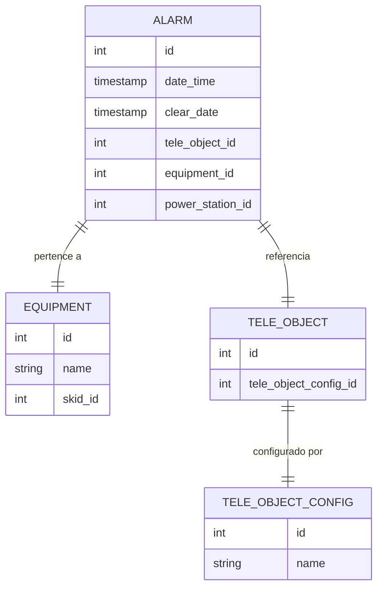
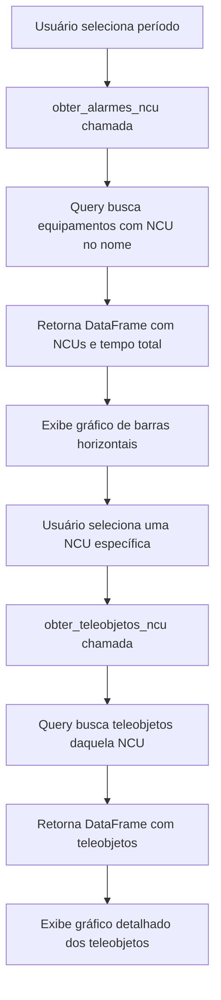
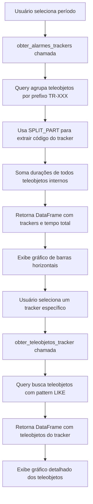
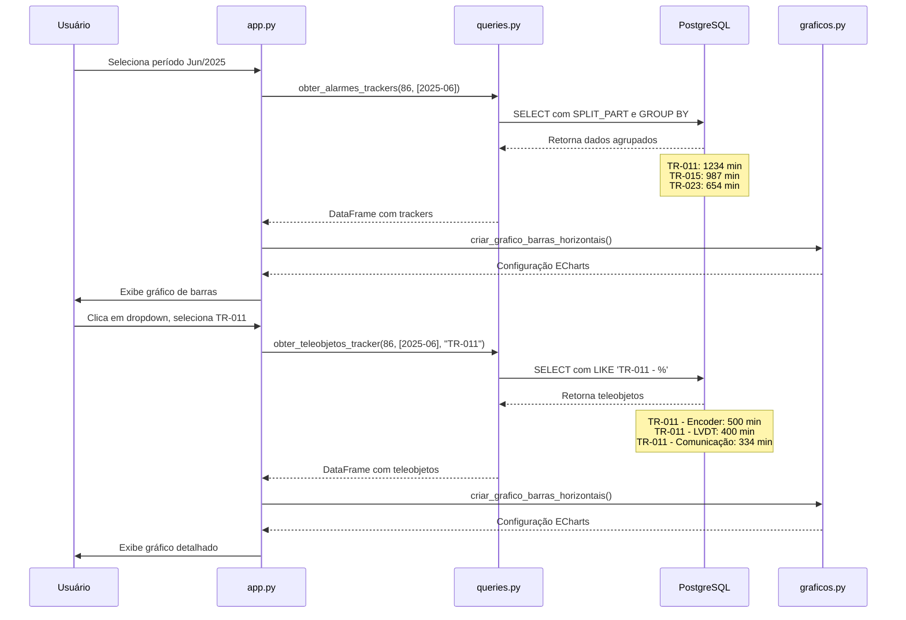

# 📊 Implementação de Análise de NCU e Trackers
## Sistema de Análise de Alarmes (SAA)

---

## 📋 Sumário

1. [Visão Geral](#visão-geral)
2. [Arquitetura da Solução](#arquitetura-da-solução)
3. [Queries Específicas para NCU](#queries-específicas-para-ncu)
4. [Queries Específicas para Trackers](#queries-específicas-para-trackers)
5. [Implementação no App.py](#implementação-no-apppy)
6. [Visualizações e Gráficos](#visualizações-e-gráficos)
7. [Fluxo de Dados Completo](#fluxo-de-dados-completo)

---

## 🎯 Visão Geral

### Objetivo da Implementação

O sistema **SAA (Sistema de Análise de Alarmes)** foi desenvolvido para fornecer análises detalhadas de alarmes em usinas fotovoltaicas. Dentre as funcionalidades implementadas, duas se destacam pela complexidade e importância estratégica:

1. **Análise de NCU (Network Control Unit)**: Equipamentos centralizadores de comunicação
2. **Análise de Trackers (TR-XXX)**: Dispositivos de rastreamento solar que possuem múltiplos teleobjetos internos

### Problema Resolvido

**Desafio para NCUs:**
- NCUs centralizam comunicação de múltiplos equipamentos
- Precisamos visualizar tanto o tempo total alarmado de cada NCU quanto os teleobjetos específicos que causaram alarmes
- Necessidade de drill-down (detalhamento) para investigação

**Desafio para Trackers:**
- Cada tracker (ex: TR-011, TR-015) possui múltiplos teleobjetos internos (ex: TR-011 - Encoder, TR-011 - LVDT, etc.)
- Precisamos agrupar todos os teleobjetos de um mesmo tracker para entender o tempo total alarmado
- Necessidade de visualizar a contribuição de cada teleobjeto interno

---

## 🏗️ Arquitetura da Solução

### Estrutura do Banco de Dados

O sistema trabalha com um banco PostgreSQL onde os alarmes são armazenados em tabelas mensais:

```
powerstation_86_alarm_2025_06  ← Tabela de alarmes de Junho/2025 da Usina 86
powerstation_86_alarm_2025_07  ← Tabela de alarmes de Julho/2025 da Usina 86
...
```

**Estrutura de Relacionamentos:**



### Camadas da Aplicação

```
┌─────────────────────────────────────┐
│      app.py (Interface)             │
│  - Renderização de gráficos         │
│  - Interação do usuário             │
│  - Seleção de NCU/Tracker           │
└──────────────┬──────────────────────┘
               │
               ↓
┌─────────────────────────────────────┐
│    database/queries.py (Lógica)     │
│  - obter_alarmes_ncu()              │
│  - obter_teleobjetos_ncu()          │
│  - obter_alarmes_trackers()         │
│  - obter_teleobjetos_tracker()      │
└──────────────┬──────────────────────┘
               │
               ↓
┌─────────────────────────────────────┐
│    PostgreSQL (Dados)               │
│  - Tabelas de alarmes por mês       │
│  - Tabelas de equipamentos          │
│  - Tabelas de teleobjetos           │
└─────────────────────────────────────┘
```

---

## 🖥️ Queries Específicas para NCU

### 1️⃣ Função: `obter_alarmes_ncu()`

**Localização:** `database/queries.py` (linhas 1098-1154)

#### Objetivo
Buscar todos os equipamentos que possuem "NCU" no nome e calcular o tempo total alarmado de cada um.

#### Query SQL Detalhada

```python
def obter_alarmes_ncu(
    usina_id: int, 
    periodos: List[Dict[str, int]], 
    limite: int = LIMITE_TOP_10
) -> pd.DataFrame:
    """
    Obtém alarmes de equipamentos NCU (que contêm "NCU" no nome).
    
    Parâmetros:
        usina_id: ID da usina
        periodos: Lista de períodos {'ano': ..., 'mes': ...}
        limite: Número máximo de equipamentos NCU (padrão: 10)
    
    Retorna:
        DataFrame: Colunas [equipamento_nome, skid_nome, equipamento_nome_formatado,
                           quantidade_alarmes, duracao_total_minutos]
    """
```

#### Anatomia da Query SQL

```sql
-- PASSO 1: Construir UNION ALL de tabelas mensais
-- Exemplo: Se períodos = [{'ano': 2025, 'mes': 6}, {'ano': 2025, 'mes': 7}]
-- Irá criar:
-- SELECT * FROM powerstation_86_alarm_2025_06
-- UNION ALL
-- SELECT * FROM powerstation_86_alarm_2025_07

-- PASSO 2: Query principal com JOINs
SELECT
    -- Nome do equipamento (ex: "NCU - Inversor 01")
    e.name AS equipamento_nome,
    
    -- Nome do SKID (se existir, senão 'N/A')
    COALESCE(s.name, 'N/A') AS skid_nome,
    
    -- Nome formatado para exibição (ex: "NCU - Inversor 01 - (SKID 01)")
    CASE 
        WHEN s.name IS NOT NULL THEN e.name || ' - (' || s.name || ')'
        ELSE e.name
    END AS equipamento_nome_formatado,
    
    -- Quantidade total de alarmes
    COUNT(a.id) AS quantidade_alarmes,
    
    -- Duração total em minutos (soma de todos os alarmes)
    ROUND(
        SUM(
            -- EXTRACT(EPOCH FROM ...) converte intervalo de tempo em segundos
            EXTRACT(EPOCH FROM (
                -- Se clear_date for NULL, usa NOW() (alarme ainda ativo)
                COALESCE(a.clear_date, NOW()) - a.date_time
            )) / 60  -- Divide por 60 para converter segundos em minutos
        ), 2
    ) AS duracao_total_minutos

FROM (
    -- Subquery com UNION ALL das tabelas mensais
    {union_tabelas}
) a

-- JOIN com tabela de equipamentos
JOIN public.equipment e ON a.equipment_id = e.id

-- LEFT JOIN com tabela de SKIDs (pode não ter SKID)
LEFT JOIN public.skid s ON e.skid_id = s.id

WHERE 
    -- Filtrar apenas a usina selecionada
    a.power_station_id = :usina_id
    
    -- FILTRO ESPECIAL: Equipamentos que contêm "NCU" no nome
    -- ILIKE = case-insensitive LIKE (ignora maiúsculas/minúsculas)
    AND e.name ILIKE '%NCU%'

-- Agrupar por equipamento e SKID
GROUP BY e.id, e.name, s.name

-- Ordenar pelos que tiveram mais tempo alarmado
ORDER BY duracao_total_minutos DESC

-- Limitar aos TOP 10 (ou valor configurado)
LIMIT :limite
```

#### Explicação dos Conceitos-Chave

**1. COALESCE(a.clear_date, NOW())**
- Se o alarme foi finalizado (`clear_date` não é NULL), usa a data de finalização
- Se o alarme ainda está ativo (`clear_date` é NULL), usa a data/hora atual
- Isso permite calcular a duração de alarmes ativos

**2. EXTRACT(EPOCH FROM intervalo)**
- Converte um intervalo de tempo (ex: "2 horas 30 minutos") em segundos totais
- Exemplo: `EXTRACT(EPOCH FROM '02:30:00'::interval)` retorna `9000` segundos

**3. ILIKE '%NCU%'**
- Busca pattern case-insensitive (ignora maiúsculas/minúsculas)
- `%` = wildcard que representa qualquer sequência de caracteres
- Captura: "NCU-01", "ncu inversor", "Inversor NCU", etc.

**4. LEFT JOIN vs JOIN**
- `JOIN`: Retorna apenas registros que têm correspondência em ambas as tabelas
- `LEFT JOIN`: Retorna todos os registros da tabela esquerda, mesmo sem correspondência
- Usado para `skid` porque nem todos os equipamentos têm SKID associado

---

### 2️⃣ Função: `obter_teleobjetos_ncu()`

**Localização:** `database/queries.py` (linhas 1157-1210)

#### Objetivo
Para uma NCU específica, listar todos os teleobjetos que geraram alarmes e seus respectivos tempos.

#### Query SQL Detalhada

```sql
SELECT
    -- Nome do teleobjeto (ex: "Comunicação Perdida", "Temperatura Alta")
    toc.name AS teleobjeto_nome,
    
    -- Quantidade de vezes que este teleobjeto alarmou
    COUNT(a.id) AS quantidade_alarmes,
    
    -- Duração total alarmada por este teleobjeto
    ROUND(
        SUM(
            EXTRACT(EPOCH FROM (
                COALESCE(a.clear_date, NOW()) - a.date_time
            )) / 60
        ), 2
    ) AS duracao_total_minutos

FROM (
    {union_tabelas}  -- UNION ALL das tabelas mensais
) a

-- JOIN com equipamento para filtrar apenas a NCU desejada
JOIN public.equipment e ON a.equipment_id = e.id

-- JOIN com teleobjeto
JOIN public.tele_object tobj ON a.tele_object_id = tobj.id

-- JOIN com configuração do teleobjeto (onde está o nome)
JOIN public.tele_object_config toc ON tobj.tele_object_config_id = toc.id

WHERE 
    -- Filtrar apenas a usina selecionada
    a.power_station_id = :usina_id
    
    -- FILTRO ESPECIAL: Apenas alarmes da NCU selecionada
    -- Usa = ao invés de LIKE porque já temos o nome exato
    AND e.name = :ncu_nome

-- Agrupar por teleobjeto
GROUP BY toc.id, toc.name

-- Ordenar pelos teleobjetos que mais alarmaram
ORDER BY duracao_total_minutos DESC

-- Limitar aos TOP 20
LIMIT :limite
```

#### Fluxo de Dados NCU



---

## 📍 Queries Específicas para Trackers

### 3️⃣ Função: `obter_alarmes_trackers()`

**Localização:** `database/queries.py` (linhas 1217-1277)

#### Objetivo
Agrupar todos os teleobjetos que pertencem ao mesmo tracker (ex: TR-011) e somar o tempo total alarmado.

#### Context: Estrutura de Nomes de Trackers

Os teleobjetos de trackers seguem este padrão de nomenclatura:
```
TR-011 - Encoder
TR-011 - LVDT
TR-011 - Comunicação
TR-015 - Encoder
TR-015 - LVDT
...
```

Queremos agrupar por: `TR-011`, `TR-015`, etc.

#### Query SQL Detalhada

```sql
SELECT
    -- FUNÇÃO ESPECIAL: SPLIT_PART
    -- Divide a string pelo delimitador ' - ' e pega a primeira parte
    -- Exemplo: "TR-011 - Encoder" → "TR-011"
    SPLIT_PART(toc.name, ' - ', 1) AS tracker_code,
    
    -- Quantidade total de alarmes de TODOS os teleobjetos deste tracker
    COUNT(a.id) AS quantidade_alarmes,
    
    -- Duração total somada de TODOS os teleobjetos deste tracker
    ROUND(
        SUM(
            EXTRACT(EPOCH FROM (
                COALESCE(a.clear_date, NOW()) - a.date_time
            )) / 60
        ), 2
    ) AS duracao_total_minutos

FROM (
    {union_tabelas}  -- UNION ALL das tabelas mensais
) a

-- JOIN com teleobjeto
JOIN public.tele_object tobj ON a.tele_object_id = tobj.id

-- JOIN com configuração do teleobjeto
JOIN public.tele_object_config toc ON tobj.tele_object_config_id = toc.id

WHERE 
    -- Filtrar apenas a usina selecionada
    a.power_station_id = :usina_id
    
    -- FILTRO ESPECIAL: Apenas teleobjetos que começam com "TR-"
    -- LIKE 'TR-%' captura qualquer nome que inicie com "TR-"
    AND toc.name LIKE 'TR-%'

-- AGRUPAMENTO ESPECIAL: Agrupar pela primeira parte do nome (tracker_code)
-- Isto faz com que:
--   "TR-011 - Encoder"     ]
--   "TR-011 - LVDT"        ] → Sejam agrupados como "TR-011"
--   "TR-011 - Comunicação" ]
GROUP BY tracker_code

-- Ordenar pelos trackers que mais alarmaram
ORDER BY duracao_total_minutos DESC

-- Limitar aos TOP 20
LIMIT :limite
```

#### Explicação Detalhada: SPLIT_PART

**Sintaxe:**
```sql
SPLIT_PART(string, delimiter, position)
```

**Parâmetros:**
- `string`: Texto a ser dividido
- `delimiter`: Caractere(s) usado(s) para dividir
- `position`: Qual parte retornar (1 = primeira, 2 = segunda, etc.)

**Exemplos:**

```sql
-- Exemplo 1
SELECT SPLIT_PART('TR-011 - Encoder', ' - ', 1);
-- Resultado: 'TR-011'

-- Exemplo 2
SELECT SPLIT_PART('TR-011 - Encoder', ' - ', 2);
-- Resultado: 'Encoder'

-- Exemplo 3
SELECT SPLIT_PART('TR-015 - LVDT', ' - ', 1);
-- Resultado: 'TR-015'
```

**Por que usar SPLIT_PART?**

Sem o SPLIT_PART, teríamos resultados separados:
```
TR-011 - Encoder      → 45 min
TR-011 - LVDT         → 30 min
TR-011 - Comunicação  → 25 min
```

Com o SPLIT_PART, agregamos tudo:
```
TR-011  → 100 min (45 + 30 + 25)
```

---

### 4️⃣ Função: `obter_teleobjetos_tracker()`

**Localização:** `database/queries.py` (linhas 1280-1333)

#### Objetivo
Para um tracker específico (ex: TR-011), listar todos os seus teleobjetos internos e o tempo alarmado de cada um.

#### Query SQL Detalhada

```sql
SELECT
    -- Nome completo do teleobjeto (ex: "TR-011 - Encoder")
    toc.name AS teleobjeto_nome,
    
    -- Quantidade de alarmes deste teleobjeto específico
    COUNT(a.id) AS quantidade_alarmes,
    
    -- Duração total deste teleobjeto específico
    ROUND(
        SUM(
            EXTRACT(EPOCH FROM (
                COALESCE(a.clear_date, NOW()) - a.date_time
            )) / 60
        ), 2
    ) AS duracao_total_minutos

FROM (
    {union_tabelas}  -- UNION ALL das tabelas mensais
) a

-- JOIN com teleobjeto
JOIN public.tele_object tobj ON a.tele_object_id = tobj.id

-- JOIN com configuração do teleobjeto
JOIN public.tele_object_config toc ON tobj.tele_object_config_id = toc.id

WHERE 
    -- Filtrar apenas a usina selecionada
    a.power_station_id = :usina_id
    
    -- FILTRO ESPECIAL: Pattern matching para teleobjetos do tracker
    -- Se tracker_code = "TR-011", então procura por "TR-011 - %"
    -- O wildcard % captura qualquer coisa após o código do tracker
    AND toc.name LIKE :tracker_pattern

-- Agrupar por teleobjeto completo
GROUP BY toc.id, toc.name

-- Ordenar pelos teleobjetos que mais alarmaram
ORDER BY duracao_total_minutos DESC

-- Limitar aos TOP 20
LIMIT :limite
```

#### Construção do Pattern em Python

```python
# No código Python, o pattern é construído assim:
tracker_pattern = f"{tracker_code} - %"

# Exemplos:
# Se tracker_code = "TR-011"
# tracker_pattern = "TR-011 - %"
# 
# Isto irá capturar:
# ✅ "TR-011 - Encoder"
# ✅ "TR-011 - LVDT"
# ✅ "TR-011 - Comunicação"
# ❌ "TR-015 - Encoder"  (não captura, código diferente)
# ❌ "TR-011"  (não captura, falta o " - ")
```

#### Fluxo de Dados Trackers



---

## 📱 Implementação no App.py

### Seção de Análise de NCU

**Localização:** `app.py` (linhas 580-658)

```python
# SEÇÃO ESPECIAL: ANÁLISE DE NCUs
st.subheader("🖥️ Análise de NCUs (Network Control Units)")

try:
    # PASSO 1: Buscar todos os alarmes de equipamentos NCU
    df_ncu = obter_alarmes_ncu(usina_id, periodos_validos, LIMITE_TOP_10)
    
    if not df_ncu.empty:
        # PASSO 2: Criar gráfico de barras horizontais
        from streamlit_echarts import st_echarts
        
        grafico_ncu = criar_grafico_barras_horizontais(
            dataframe=df_ncu,
            titulo="Top NCUs por Tempo Total Alarmado",
            coluna_nome="equipamento_nome_formatado",  # Nome do eixo Y
            coluna_valor="duracao_total_minutos",      # Valor do eixo X
            nome_serie="Tempo Total (min)",            # Label da série
            cor="#FF6B6B",                             # Cor das barras
            mostrar_valor=True,                        # Mostrar valores nas barras
            formato_valor="tempo"                      # Formatar como tempo
        )
        st_echarts(grafico_ncu, height="400px")
        
        # PASSO 3: Seleção interativa de NCU
        st.markdown("### 🔍 Detalhes dos Teleobjetos por NCU")
        
        # Criar mapeamento: nome_formatado → nome_original
        # Necessário porque o gráfico usa nome formatado, 
        # mas a query precisa do nome original
        ncu_dict = dict(zip(
            df_ncu['equipamento_nome_formatado'],  # Chave
            df_ncu['equipamento_nome']             # Valor
        ))
        ncu_opcoes = list(ncu_dict.keys())
        
        # PASSO 4: Dropdown de seleção
        ncu_selecionada_formatada = st.selectbox(
            "Selecione uma NCU para ver seus teleobjetos:",
            options=ncu_opcoes,
            key="ncu_selector"
        )
        
        if ncu_selecionada_formatada:
            # Obter nome original do equipamento
            ncu_nome_original = ncu_dict[ncu_selecionada_formatada]
            
            # PASSO 5: Buscar teleobjetos da NCU selecionada
            df_teleobjetos_ncu = obter_teleobjetos_ncu(
                usina_id, 
                periodos_validos, 
                ncu_nome_original,  # Nome original, não formatado
                LIMITE_TOP_20
            )
            
            if not df_teleobjetos_ncu.empty:
                st.markdown(f"**📊 Teleobjetos da NCU: {ncu_selecionada_formatada}**")
                
                # PASSO 6: Gráfico de teleobjetos
                grafico_tele_ncu = criar_grafico_barras_horizontais(
                    dataframe=df_teleobjetos_ncu,
                    titulo=f"Teleobjetos - {ncu_selecionada_formatada}",
                    coluna_nome="teleobjeto_nome",
                    coluna_valor="duracao_total_minutos",
                    nome_serie="Tempo Alarmado (min)",
                    cor="#4ECDC4",  # Cor diferente para diferenciar
                    mostrar_valor=True,
                    formato_valor="tempo"
                )
                st_echarts(grafico_tele_ncu, height="500px")
                
                # PASSO 7: Tabela detalhada (opcional, expansível)
                with st.expander("📋 Ver Tabela Detalhada"):
                    st.dataframe(
                        df_teleobjetos_ncu,
                        use_container_width=True,
                        hide_index=True
                    )
            else:
                st.info(f"📄 Nenhum teleobjeto encontrado para a NCU {ncu_selecionada_formatada}.")
    else:
        st.info("📄 Nenhum equipamento NCU encontrado no período selecionado.")
        
except Exception as e:
    logger.error(f"Erro ao exibir análise de NCU: {e}")
    st.error(f"❌ Erro ao carregar análise de NCU: {str(e)}")
```

#### Aspectos Importantes da Implementação

**1. Tratamento de Erros**
```python
try:
    # Código principal
except Exception as e:
    logger.error(f"Erro: {e}")  # Log para debug
    st.error(f"❌ Erro: {str(e)}")  # Mensagem amigável para usuário
```

**2. Validação de Dados Vazios**
```python
if not df_ncu.empty:
    # Exibir gráfico
else:
    st.info("📄 Nenhum dado disponível")  # Mensagem informativa
```

**3. Mapeamento de Nomes**
```python
# Por que fazer isso?
# - Gráfico usa nome formatado: "NCU-01 - (SKID 01)"
# - Query precisa nome original: "NCU-01"
# - Mapeamento resolve essa diferença
ncu_dict = dict(zip(formatados, originais))
```

---

### Seção de Análise de Trackers

**Localização:** `app.py` (linhas 661-734)

```python
# GRÁFICO INTERMEDIÁRIO: Análise de Trackers (TR-XXX)
st.subheader("📍 Análise de Trackers (TR-XXX)")

try:
    # PASSO 1: Buscar todos os alarmes agrupados por Tracker
    df_trackers = obter_alarmes_trackers(
        usina_id, 
        periodos_validos, 
        limite=20  # Mais trackers, pois são agrupamentos
    )
    
    if not df_trackers.empty:
        # PASSO 2: Criar gráfico de barras horizontais
        from streamlit_echarts import st_echarts
        
        grafico_trackers = criar_grafico_barras_horizontais(
            dataframe=df_trackers,
            titulo="Tempo Total Alarmado por Tracker (TR-XXX)",
            coluna_nome="tracker_code",             # Ex: "TR-011"
            coluna_valor="duracao_total_minutos",   # Tempo somado
            nome_serie="Tempo Total (min)",
            cor="#9B59B6",                          # Cor roxa para diferenciação
            mostrar_valor=True,
            formato_valor="tempo"
        )
        st_echarts(grafico_trackers, height="450px")
        
        # PASSO 3: Seleção interativa de Tracker
        st.markdown("### 🔍 Detalhes dos Teleobjetos por Tracker")
        
        # Lista de códigos de trackers (ex: ["TR-011", "TR-015", ...])
        tracker_opcoes = df_trackers['tracker_code'].tolist()
        
        # PASSO 4: Dropdown de seleção
        tracker_selecionado = st.selectbox(
            "Selecione um Tracker para ver seus teleobjetos:",
            options=tracker_opcoes,
            key="tracker_selector"
        )
        
        if tracker_selecionado:
            # PASSO 5: Buscar teleobjetos do Tracker selecionado
            df_teleobjetos_tracker = obter_teleobjetos_tracker(
                usina_id, 
                periodos_validos, 
                tracker_selecionado,  # Ex: "TR-011"
                limite=25  # Mais teleobjetos para análise detalhada
            )
            
            if not df_teleobjetos_tracker.empty:
                st.markdown(f"**📊 Teleobjetos do Tracker: {tracker_selecionado}**")
                
                # PASSO 6: Gráfico de teleobjetos
                grafico_tele_tracker = criar_grafico_barras_horizontais(
                    dataframe=df_teleobjetos_tracker,
                    titulo=f"Teleobjetos - {tracker_selecionado}",
                    coluna_nome="teleobjeto_nome",  # Nomes completos
                    coluna_valor="duracao_total_minutos",
                    nome_serie="Tempo Alarmado (min)",
                    cor="#F39C12",  # Cor laranja para diferenciação
                    mostrar_valor=True,
                    formato_valor="tempo"
                )
                st_echarts(grafico_tele_tracker, height="500px")
                
                # PASSO 7: Tabela detalhada (opcional, expansível)
                with st.expander("📋 Ver Tabela Detalhada"):
                    st.dataframe(
                        df_teleobjetos_tracker,
                        use_container_width=True,
                        hide_index=True
                    )
            else:
                st.info(f"📄 Nenhum teleobjeto encontrado para o Tracker {tracker_selecionado}.")
    else:
        st.info("📄 Nenhum Tracker (TR-XXX) encontrado no período selecionado.")
        
except Exception as e:
    logger.error(f"Erro ao exibir análise de Trackers: {e}")
    st.error(f"❌ Erro ao carregar análise de Trackers: {str(e)}")
```

---

## 📊 Visualizações e Gráficos

### Função: `criar_grafico_barras_horizontais()`

**Localização:** `visualizacoes/graficos.py`

Esta função é reutilizada tanto para NCUs quanto para Trackers, demonstrando o princípio DRY (Don't Repeat Yourself).

#### Parâmetros Utilizados

```python
def criar_grafico_barras_horizontais(
    dataframe,           # DataFrame com os dados
    titulo,              # Título do gráfico
    coluna_nome,         # Nome da coluna para o eixo Y (labels)
    coluna_valor,        # Nome da coluna para o eixo X (valores)
    nome_serie,          # Nome da série de dados
    cor="#3498db",       # Cor das barras (padrão: azul)
    mostrar_valor=True,  # Mostrar valores nas barras
    formato_valor=None   # "tempo" para formatar como HH:MM
):
```

#### Exemplo de Configuração ECharts

```python
{
    'title': {
        'text': 'Tempo Total Alarmado por Tracker (TR-XXX)',
        'left': 'center'
    },
    'tooltip': {
        'trigger': 'axis',
        'axisPointer': {
            'type': 'shadow'
        }
    },
    'grid': {
        'left': '20%',    # Espaço para labels longos
        'right': '10%',
        'bottom': '10%',
        'top': '15%'
    },
    'xAxis': {
        'type': 'value',
        'name': 'Tempo (minutos)'
    },
    'yAxis': {
        'type': 'category',
        'data': ['TR-011', 'TR-015', 'TR-023', ...],  # Códigos dos trackers
        'inverse': True  # Maior valor no topo
    },
    'series': [{
        'name': 'Tempo Total (min)',
        'type': 'bar',
        'data': [1234.5, 987.3, 654.2, ...],  # Valores
        'itemStyle': {
            'color': '#9B59B6'  # Cor roxa
        },
        'label': {
            'show': True,
            'position': 'right',
            'formatter': '{c} min'  # Formato do label
        }
    }]
}
```

#### Paleta de Cores Utilizada

| Seção | Cor | Código Hex | Uso |
|-------|-----|------------|-----|
| NCU Principal | Vermelho Suave | `#FF6B6B` | Gráfico principal de NCUs |
| Teleobjetos NCU | Ciano | `#4ECDC4` | Teleobjetos dentro de uma NCU |
| Tracker Principal | Roxo | `#9B59B6` | Gráfico principal de Trackers |
| Teleobjetos Tracker | Laranja | `#F39C12` | Teleobjetos dentro de um Tracker |

---

## 🔄 Fluxo de Dados Completo

### Exemplo Prático: Análise de Tracker TR-011



### Transformação de Dados: Exemplo Real

#### Dados Brutos no Banco

```
Tabela: powerstation_86_alarm_2025_06

id  | date_time           | clear_date          | tele_object_id | equipment_id
----|---------------------|---------------------|----------------|-------------
1   | 2025-06-01 10:00:00 | 2025-06-01 12:30:00 | 501            | 12
2   | 2025-06-02 14:00:00 | 2025-06-02 14:45:00 | 502            | 12
3   | 2025-06-03 08:00:00 | 2025-06-03 09:15:00 | 501            | 12
```

#### Tabelas de Referência

```
Tabela: tele_object
id  | tele_object_config_id
----|----------------------
501 | 2001
502 | 2002

Tabela: tele_object_config
id   | name
-----|--------------------
2001 | TR-011 - Encoder
2002 | TR-011 - LVDT
```

#### Aplicação da Query `obter_alarmes_trackers()`

**Passo 1: JOIN das tabelas**
```
id  | tele_object_config_name  | duration_minutes
----|--------------------------|------------------
1   | TR-011 - Encoder         | 150.0
2   | TR-011 - LVDT            | 45.0
3   | TR-011 - Encoder         | 75.0
```

**Passo 2: SPLIT_PART**
```
id  | tracker_code | duration_minutes
----|--------------|------------------
1   | TR-011       | 150.0
2   | TR-011       | 45.0
3   | TR-011       | 75.0
```

**Passo 3: GROUP BY tracker_code**
```
tracker_code | quantidade_alarmes | duracao_total_minutos
-------------|--------------------|-----------------------
TR-011       | 3                  | 270.0
```

**Resultado Final (DataFrame)**
```python
   tracker_code  quantidade_alarmes  duracao_total_minutos
0        TR-011                   3                  270.0
```

---

## 🎓 Conceitos SQL Avançados Utilizados

### 1. UNION ALL para Múltiplas Tabelas

**Problema:** Dados espalhados em tabelas mensais

**Solução:**
```python
def construir_union_all_tabelas(usina_id, periodos):
    """
    Construi dinâmicamente um UNION ALL de tabelas mensais.
    
    Exemplo de retorno:
    "SELECT * FROM powerstation_86_alarm_2025_06
     UNION ALL
     SELECT * FROM powerstation_86_alarm_2025_07"
    """
    queries = []
    for periodo in periodos:
        ano = periodo['ano']
        mes = periodo['mes']
        tabela = f"powerstation_{usina_id}_alarm_{ano}_{mes:02d}"
        queries.append(f"SELECT * FROM public.{tabela}")
    
    return " UNION ALL ".join(queries)
```

**Por que UNION ALL e não UNION?**
- `UNION`: Remove duplicatas (mais lento)
- `UNION ALL`: Mantém duplicatas (mais rápido)
- No nosso caso, não há duplicatas entre tabelas mensais, então usamos UNION ALL

---

### 2. Expressões CASE para Formatação Condicional

```sql
CASE 
    WHEN s.name IS NOT NULL THEN e.name || ' - (' || s.name || ')'
    ELSE e.name
END AS equipamento_nome_formatado
```

**Lógica:**
- **Se** o equipamento tem SKID associado:
  - Formato: "NCU-01 - (SKID 01)"
- **Senão**:
  - Formato: "NCU-01"

---

### 3. Funções de Agregação Complexas

```sql
ROUND(
    SUM(
        EXTRACT(EPOCH FROM (
            COALESCE(a.clear_date, NOW()) - a.date_time
        )) / 60
    ), 2
) AS duracao_total_minutos
```

**Camadas de processamento:**
1. `a.date_time` - `COALESCE(a.clear_date, NOW())` → Intervalo de tempo
2. `EXTRACT(EPOCH FROM ...)` → Converte para segundos
3. `... / 60` → Converte para minutos
4. `SUM(...)` → Soma todos os valores
5. `ROUND(..., 2)` → Arredonda para 2 casas decimais

---

### 4. Pattern Matching com LIKE e ILIKE

```sql
-- Case-insensitive (ILIKE)
WHERE e.name ILIKE '%NCU%'

-- Case-sensitive (LIKE)
WHERE toc.name LIKE 'TR-%'

-- Pattern específico
WHERE toc.name LIKE 'TR-011 - %'
```

**Wildcards:**
- `%` = Qualquer sequência de caracteres (incluindo vazio)
- `_` = Exatamente um caractere

**Exemplos:**
```sql
'TR-%'       captura: 'TR-011', 'TR-015', 'TR-ABC'
'TR-0%'      captura: 'TR-011', 'TR-015', mas não 'TR-ABC'
'TR-___'     captura: 'TR-011', 'TR-ABC', mas não 'TR-1'
```

---

## 🚀 Otimizações Implementadas

### 1. Limite de Resultados

```python
# Diferentes limites para diferentes contextos
LIMITE_TOP_5 = 5     # Visões resumidas
LIMITE_TOP_10 = 10   # Padrão para rankings
LIMITE_TOP_20 = 20   # Análises detalhadas (NCU, Trackers)
```

**Benefício:** Evita sobrecarga de dados e melhora performance

---

### 2. Índices no Banco de Dados

**Recomendação:**
```sql
-- Índice para busca por equipamento
CREATE INDEX idx_alarm_equipment_id ON powerstation_86_alarm_2025_06(equipment_id);

-- Índice para busca por teleobjeto
CREATE INDEX idx_alarm_tele_object_id ON powerstation_86_alarm_2025_06(tele_object_id);

-- Índice para filtro de usina
CREATE INDEX idx_alarm_power_station_id ON powerstation_86_alarm_2025_06(power_station_id);

-- Índice composto para queries frequentes
CREATE INDEX idx_alarm_composite ON powerstation_86_alarm_2025_06(
    power_station_id, 
    equipment_id, 
    date_time
);
```

---

### 3. Filtragem de Períodos Válidos

```python
# Antes de fazer queries, validar períodos disponíveis
periodos_validos = filtrar_periodos_validos(usina_id, periodos)

# Evita tentar acessar tabelas inexistentes
# Exemplo: Tentar acessar powerstation_86_alarm_2025_12 quando não existe
```

---

## 📈 Métricas e KPIs Calculados

### Para NCUs

| Métrica | Cálculo | Exemplo |
|---------|---------|---------|
| **Quantidade de Alarmes** | `COUNT(a.id)` | 150 alarmes |
| **Duração Total** | `SUM(duração de cada alarme)` | 1234.5 minutos |
| **Duração Média** | `AVG(duração de cada alarme)` | 8.23 min/alarme |

### Para Trackers

| Métrica | Cálculo | Exemplo |
|---------|---------|---------|
| **Trackers Identificados** | `COUNT(DISTINCT tracker_code)` | 25 trackers |
| **Teleobjetos por Tracker** | `COUNT(teleobjetos) GROUP BY tracker` | 5-8 teleobjetos/tracker |
| **Tempo Total Agregado** | `SUM(tempo de todos teleobjetos)` | 2500 minutos |

---

## 🎯 Casos de Uso e Benefícios

### Caso de Uso 1: Identificação de Problemas de Comunicação

**Cenário:**
Uma NCU específica está com muitos alarmes.

**Como o sistema ajuda:**
1. Gráfico mostra NCUs com mais tempo alarmado
2. Usuário seleciona a NCU problemática
3. Sistema exibe teleobjetos específicos
4. Descobre que "Comunicação Perdida" é o principal problema
5. Equipe técnica pode focar na solução de comunicação

---

### Caso de Uso 2: Manutenção Preventiva de Trackers

**Cenário:**
Identificar trackers que precisam de manutenção.

**Como o sistema ajuda:**
1. Gráfico mostra trackers com mais alarmes
2. TR-011 aparece no topo com 2500 minutos
3. Drill-down mostra que "LVDT" tem 80% do tempo
4. Equipe agenda manutenção específica no sensor LVDT
5. Evita troca desnecessária de componentes funcionais

---

### Caso de Uso 3: Análise de Tendências

**Cenário:**
Comparar desempenho entre meses.

**Como o sistema ajuda:**
1. Selecionar Junho e Julho
2. Comparar tempo total de alarmes de TR-015
3. Se houve aumento significativo, investigar causas
4. Verificar se manutenção foi efetiva

---

## 🔧 Possíveis Melhorias Futuras

### 1. Cache de Resultados

```python
import streamlit as st

@st.cache_data(ttl=3600)  # Cache por 1 hora
def obter_alarmes_trackers_cached(usina_id, periodos, limite):
    return obter_alarmes_trackers(usina_id, periodos, limite)
```

**Benefício:** Reduz consultas ao banco de dados

---

### 2. Exportação de Relatórios

```python
def exportar_relatorio_tracker(df, tracker_code):
    """Exportar análise de tracker para Excel"""
    excel_file = f"Relatorio_{tracker_code}.xlsx"
    df.to_excel(excel_file, index=False)
    return excel_file
```

---

### 3. Alertas Automáticos

```python
def verificar_threshold(df_trackers, limite_minutos=1000):
    """Identificar trackers acima do threshold"""
    criticos = df_trackers[df_trackers['duracao_total_minutos'] > limite_minutos]
    if not criticos.empty:
        st.warning(f"⚠️ {len(criticos)} trackers acima de {limite_minutos} min!")
```

---

## 📚 Referências Técnicas

### SQL
- **SPLIT_PART**: [PostgreSQL String Functions](https://www.postgresql.org/docs/current/functions-string.html)
- **EXTRACT**: [PostgreSQL Date/Time Functions](https://www.postgresql.org/docs/current/functions-datetime.html)
- **UNION ALL**: [PostgreSQL Queries](https://www.postgresql.org/docs/current/queries-union.html)

### Python
- **Pandas**: [DataFrame Operations](https://pandas.pydata.org/docs/reference/frame.html)
- **SQLAlchemy**: [SQL Expression Language](https://docs.sqlalchemy.org/en/14/core/tutorial.html)

### Streamlit
- **Charts**: [ECharts Integration](https://github.com/andfanilo/streamlit-echarts)
- **Caching**: [st.cache_data](https://docs.streamlit.io/library/api-reference/performance/st.cache_data)

---

## ✅ Checklist de Implementação

### Queries (queries.py)
- [x] `obter_alarmes_ncu()` - Busca equipamentos NCU
- [x] `obter_teleobjetos_ncu()` - Busca teleobjetos de NCU específica
- [x] `obter_alarmes_trackers()` - Agrupa trackers com SPLIT_PART
- [x] `obter_teleobjetos_tracker()` - Busca teleobjetos de tracker específico
- [x] `construir_union_all_tabelas()` - Suporte a múltiplos períodos

### Interface (app.py)
- [x] Seção de análise de NCU
- [x] Gráfico de barras para NCUs
- [x] Seleção interativa de NCU
- [x] Gráfico detalhado de teleobjetos NCU
- [x] Seção de análise de Trackers
- [x] Gráfico de barras para Trackers
- [x] Seleção interativa de Tracker
- [x] Gráfico detalhado de teleobjetos Tracker
- [x] Tabelas expansíveis com dados brutos
- [x] Tratamento de erros e casos vazios

### Visualizações (graficos.py)
- [x] `criar_grafico_barras_horizontais()` - Reutilizável
- [x] Customização de cores por seção
- [x] Formatação de valores (tempo)
- [x] Tooltips informativos

---

## 🎉 Conclusão

A implementação de análise de **NCUs** e **Trackers** demonstra:

1. **Expertise em SQL**: Uso de funções avançadas como SPLIT_PART, agregações complexas e UNION ALL
2. **Arquitetura Modular**: Separação clara entre queries, lógica e apresentação
3. **UX Intuitiva**: Drill-down interativo com seleção de equipamentos
4. **Performance**: Otimizações com limites e validações
5. **Manutenibilidade**: Código reutilizável e bem documentado

Esta solução permite aos operadores de usinas fotovoltaicas:
- ✅ Identificar rapidamente problemas em equipamentos NCU
- ✅ Analisar trackers com múltiplos teleobjetos de forma agregada
- ✅ Fazer drill-down para investigação detalhada
- ✅ Tomar decisões baseadas em dados concretos
- ✅ Otimizar manutenção e reduzir downtime

---

**Desenvolvido com ❤️ para o Sistema de Análise de Alarmes (SAA)**
